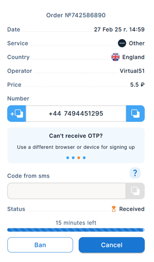
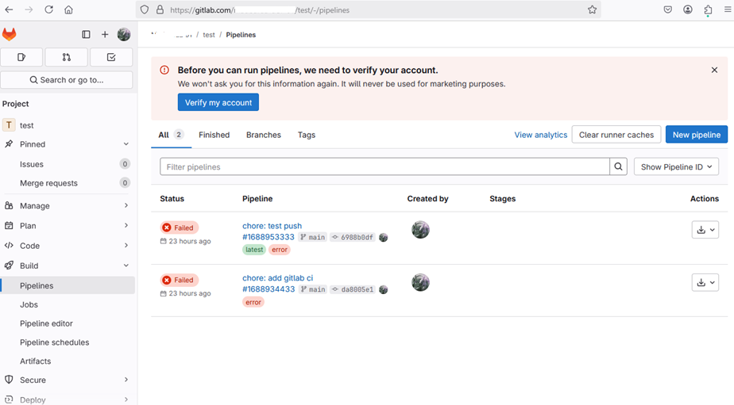

## Information

- Creating a verified GitLab account doesn't seem straightforward and easy as of February 2025, since it now asks for either (1) a phone verification or (2) credit card information for **Identity Verification** in order to trigger CI/CD pipelines.
- The following factors may or may not make creating and verifying a GitLab account straightforward depending on a developer's available resources:
   - GitLab does not support, or partially supports some countries for SMS/Phone verification, making it difficult to receive an SMS verification for these countries
   - Credit card availability
- This page discusses workarounds enabling GitLab **Identity Verification** using **Phone verification** for GitLab's [unsupported](https://docs.gitlab.com/security/identity_verification/#unsupported-countries) or [partially unsupported](https://docs.gitlab.com/security/identity_verification/#partially-supported-countries) countries

## Steps

## 1. GitLab Account

- Create and verify a GitLab account.
- This step should be straightforward, since it only requires email (or maybe GitHub, or other accessible verification methods)

## 2. Identity Verification

GitLab requires **Identity Verification** for running pipelines.

While not required, view the [Run a GitLab Pipeline](#run-a-gitlab-pipeline) section for more information on how to trigger a GitLab pipeline that fails when run by GitLab accounts that haven't yet undergone Identity Verification.

### 2A. Using A Credit Card

1. Go to <https://gitlab.com/-/identity_verification>
2. You may verify the GitLab account using a Credit Card, if you have one available.
    1. Proceed to the [2B. Using Phone Verification](#2b-using-phone-verification) or to [2C. Using a Virtual Phone No. from 5Sim](#2c-using-a-virtual-phone-no-from-5sim) section if you do not have a credit card available.
3. Follow the steps for verifying the account **using a credit card**.

### 2B. Using Phone Verification

1. You may also verify the GitLab account using a phone number.
    1. It may be good to note GitLab's [unsupported](https://docs.gitlab.com/security/identity_verification/#unsupported-countries) or [partially unsupported](https://docs.gitlab.com/security/identity_verification/#partially-supported-countries) **countries** for phone verification.
2. Go to <https://gitlab.com/-/identity_verification>
3. Follow the steps for verifying the account **using a phone number**.
4. In case your phone number is not supported by GitLab for phone verification, and you do not have a credit card available for verification, you may use a virtual phone number (supported by GitLab) as a workaround for phone verification.
    1. Proceed to [2C. Using a Virtual Phone No. from 5Sim](#2c-using-a-virtual-phone-no-from-5sim) for more information.

### 2C. Using a Virtual Phone No. from 5Sim

1. Create a 5Sim account and purchase a virtual number.
    1. Read the [Virtual Phone Numbers From 5Sim](#virtual-phone-numbers-from-5sim) for more information.
2. Verify your GitLab account. Go to <https://gitlab.com/-/identity_verification>.
3. Follow the steps for verifying the account **using a phone number**. Use the purchased virtual phone number in the 5Sim account.
    1. When prompted, use the country or region defined in the 5Sim account.
    2. Use the virtual phone number purchased within the 5Sim account.
4. Wait for GitLab's OTP within the 5Sim virtual number.
    1. Use this OTP to respond within GitLab's phone SMS OTP verification

---

## References

### Virtual Phone Numbers From 5Sim

> _"When registering on social media platforms, messengers, C2C platforms, and other websites, users may be required to complete SMS verification. **5SIM** offers a way to bypass said verification thanks to temporary virtual phone numbers — you no longer have to rely on your actual phone number. Create multiple accounts on various platforms by receiving a verification code online."_

1. Register for a 5Sim account at <https://5sim.net>
2. Select a service
    - Choose **"Other"**
3. Select a country
    1. Choose **"England"**
    2. Note: Virtual numbers from other countries may or may not work easily for GitLab identity verification. Phone numbers from "England" worked for this demonstration.
4. Take note of the Operators that will appear under the "Select operator" list
    1. Note: 5sim Operator prices are in Russian Rubble (RUB). Its symbol is **₽**.
    2. Browse for a target Operator/s. Take note of their price, e.g., 15 RUB
5. Top-up the 5Sim balance, possibly around the Operator price/s (in RUB) that you have browsed for in step # 4.
    1. Press the **"Balance"** button on the upper right menu beside the **"Purchases"** button
    2. Choose a payment method. The proceeding steps discuss methods for paying using **GCash**
    3. Select the **"Pay via digital payment systems"** option
    4. Select **"GCash Philippines"**
    5. Create an invoice by filling out the form including: `Amount in RUB` and `Amount to be paid (USD)`
    6. Proceed to payment. Follow the proceeding steps for payment using GCash.
    7. A successful GCash payment will top-up the 5sim balance (in RUB currency)
6. Purchase an Operator
    8. Check-out/purchase the Operator that you have selected on **step # 4** by pressing the "cart-like" button beside it.
    9. You will see something similar to the screenshot below after purchasing an Operator. Use the resulting virtual phone number (e.g., `+44` `7494451295`) for GitLab verification to receive an OTP code. Take note that it is only valid for around ~15 minutes.
    10. 

### Run a GitLab Pipeline

Do the following steps to trigger a failing pipeline, which will bring up the Identity Verification forms.

1. Create an empty GitLab code repository.
2. Create the following `.gitlab-ci.yml` file and push to the repository to trigger a pipeline.
3. Go to the **GitLab repository** -> **"Build"** ->  **"Pipelines"** tab.
4. You should see the a similar pipeline error after push on **step # 2**, since the account was not yet verified for running pipelines.
    1. A **"Verify my account"** button should appear in the GitLab repository's **"Pipelines"** page.

## External References

- [[notes/gitlab/index|GitLab]]
- [GitLab - Identity Verification (Unsupported Country List)](https://docs.gitlab.com/security/identity_verification/)
- Phone SMS Issues References
   - [Phone Verification SMS not received (Unable to login and register)](https://forum.gitlab.com/t/phone-verification-sms-not-received-unable-to-login-and-register/92202)
   - [When signing up for GitLab, phone SMS verification does not work](https://gitlab.com/gitlab-org/gitlab/-/issues/457892)
   - [Cannot create new account without phone number and credit card information](https://www.reddit.com/r/gitlab/comments/182orq6/cannot_create_new_account_without_phone_number/?rdt=37711)
- [5Sim](https://5sim.net)
